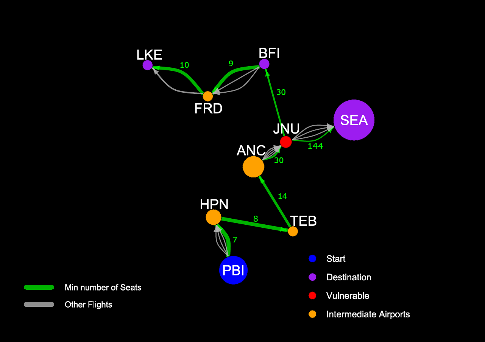

# USairports Network Analysis

## Overview
This project analyzes the USairports network dataset from the igraphdata R package. 
The network represents flights between airports in the United States.

It is a directed and weighted graph where:
- Edge direction corresponds to flight direction.
- Each edge represents a specific aircraft type operated by an airline.
- Edge weights correspond to the number of seats.

## Network Properties

- Directed graph
- 53 loops  
  These correspond to flights that departed and, due to technical issues, returned to the same airport.

- 15,208 multiple edges  
  These represent multiple airlines (or aircraft types) operating between the same pair of airports.  
  Therefore, they must not be removed, as they contain meaningful structural information.

## Case Study: West Palm Beach, FL → Seattle, WA

West Palm Beach / Palm Beach, FL contains one airport:
- PBI

Seattle, WA contains three airports:
- BFI
- SEA
- LKE

After removing loops, the minimum-seat flight paths identified were:

1. PBI → HPN → TEB → ANC → JNU → BFI  
2. PBI → HPN → TEB → ANC → JNU → SEA  
3. PBI → HPN → TEB → ANC → JNU → BFI → FRD → LKE  

## Tools Used
- R
- igraph
- igraphdata

## Author
Tsoumaris Dimitrios
